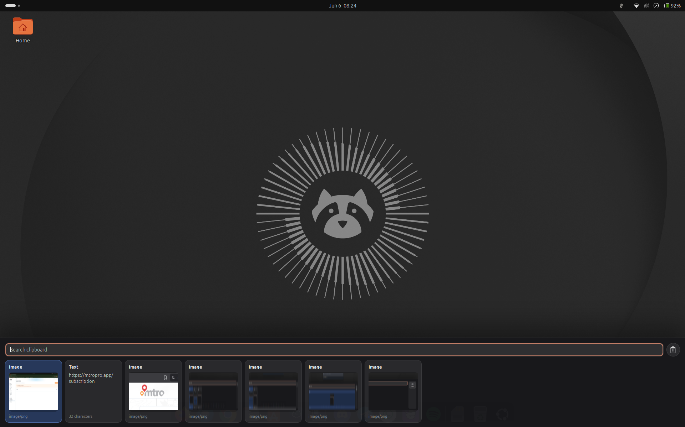

# Pastazzo

```text
 ____   _    ____ _____  _    __________ ___
|  _ \ / \  / ___|_   _|/ \  |__  /__  / _ \
| |_) / _ \ \___ \ | | / _ \   / /  / / | | |
|  __/ ___ \ ___) || |/ ___ \ / /_ / /| |_| |
|_| /_/   \_\____/ |_/_/   \_/____/____\___/
```

Pastazzo is a GNOME Wayland clipboard shelf inspired by Paste. It combines a small Rust history store with a GNOME Shell extension.



Features:

- Open the clipboard shelf with `Shift+Alt+V`
- Search text and image clipboard history
- Click once to copy an item back to the clipboard
- Double-click to copy and paste into the focused app
- Image previews for copied image files and image clipboard content
- Clear-history button in the search toolbar

## Install Or Update

On Ubuntu/GNOME:

```bash
curl -fsSL https://raw.githubusercontent.com/turinglabsorg/pastazzo/main/scripts/install.sh | bash
```

The same command updates an existing install: it pulls the latest code, rebuilds the Rust binary, reinstalls the GNOME extension, and keeps your existing history.

After every install or update, log out and log back in. GNOME Shell on Wayland does not reliably reload extension JavaScript inside the current session.

After logging back in, verify or enable the extension:

```bash
gnome-extensions enable pastazzo@turinglabs.org
```

## Verify

```bash
gnome-extensions info pastazzo@turinglabs.org
pastazzo search
```

The history lives in:

```text
~/.local/share/pastazzo/items
```

## Development

Build the backend:

```bash
cargo build --release
```

Install from a local checkout:

```bash
install -Dm755 target/release/pastazzo ~/.local/bin/pastazzo
mkdir -p ~/.local/share/gnome-shell/extensions/pastazzo@turinglabs.org
cp -a extension/. ~/.local/share/gnome-shell/extensions/pastazzo@turinglabs.org/
glib-compile-schemas ~/.local/share/gnome-shell/extensions/pastazzo@turinglabs.org/schemas
gnome-extensions enable pastazzo@turinglabs.org
```

Then log out and log back in before testing changes in GNOME Shell.

Run the UI flow tests:

```bash
cd test-harness
npm install
npm test
```

The test harness mocks the GNOME backend and verifies the shelf layout, image preview, copy/touch ordering, double-click paste, beep event, close behavior, and clear-history button.
