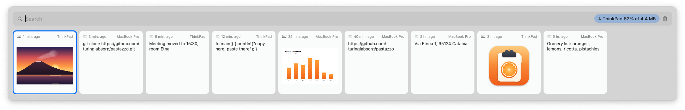
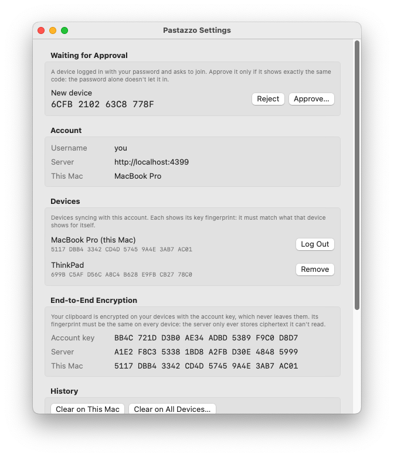
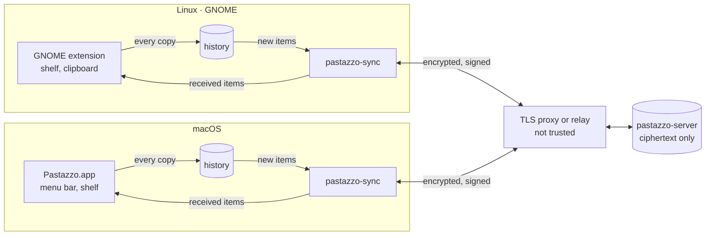
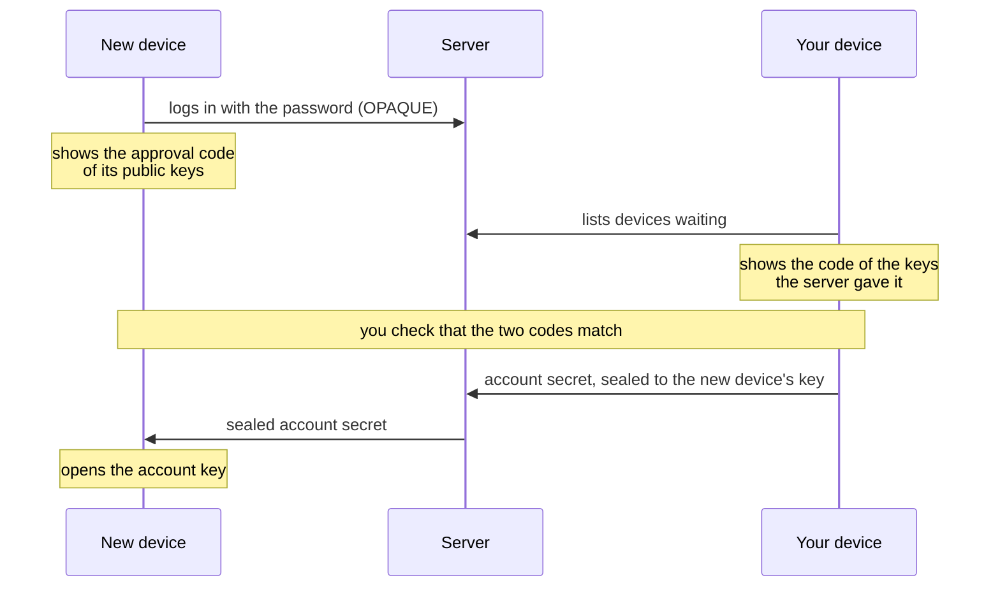

<p align="center"></p>

# Pastazzo

```text
 ____   _    ____ _____  _    __________ ___
|  _ \ / \  / ___|_   _|/ \  |__  /__  / _ \
| |_) / _ \ \___ \ | | / _ \   / /  / / | | |
|  __/ ___ \ ___) || |/ ___ \ / /_ / /| |_| |
|_| /_/   \_\____/ |_/_/   \_/____/____\___/
```

Pastazzo is a clipboard history for GNOME on Wayland and for macOS, inspired by Paste. Everything you copy, text and images, lands on a shelf you open with `Shift+Alt+V`. If you want, it also syncs the clipboard between your devices: copy on one, paste on the others, end-to-end encrypted, through a server anyone can host.


- Open the shelf with `Shift+Alt+V` (`⇧⌥V` on macOS), from any app
- Search the text and image history as you type
- Click once to copy an item back to the clipboard, double-click (or `Return`) to paste it into the app you were using
- Image previews, for copied images and image files
- Optional sync across Linux and macOS devices: every item is encrypted on the device that copied it, and only your devices can read it. The shelf shows which device each item came from, and the progress of big transfers
- Clear the history on one device or on all of them

Native [iOS](apple/ios/README.md) and [Android](android/README.md) apps join the same encrypted network by scanning a pairing QR on a trusted Mac. They provide searchable text/image history, explicit Paste and Copy, sharing, and Home Screen widgets. Mobile clipboard capture requires a deliberate action; sync refreshes while the app is active.

## Install

### Linux (GNOME on Wayland)

```bash
curl -fsSL https://raw.githubusercontent.com/turinglabsorg/pastazzo/main/scripts/install.sh | bash
```

The same command updates an existing install. It pulls the latest code, builds `pastazzo` (the history store) and `pastazzo-sync`, reinstalls the GNOME extension and the sync service, and keeps your history.

After every install or update, log out and back in: GNOME Shell on Wayland doesn't reliably reload extension code inside a running session. Then check that the extension is on:

```bash
gnome-extensions enable pastazzo@turinglabs.org
gnome-extensions info pastazzo@turinglabs.org
```

### macOS



Pastazzo for macOS is a small menu bar app. It builds with the Command Line Tools (`xcode-select --install`) and [Rust](https://rustup.rs), no Xcode needed. From Terminal, on the Mac itself rather than over SSH, since signing needs the login keychain:

```bash
git clone https://github.com/turinglabsorg/pastazzo.git
cd pastazzo
sh apple/macos/signing.sh
sh apple/macos/install.sh
```

`signing.sh` runs once. It creates a code signing certificate that only exists on your Mac, so every build gets the same signature and macOS keeps trusting it across updates (Accessibility, keychain). macOS asks for your password to trust it; when `codesign` asks to use the key, choose **Always Allow**. Without it the app is signed ad hoc and the permissions reset at every update.

`install.sh` installs `Pastazzo.app` in `/Applications`, the `pastazzo` and `pastazzo-sync` command line tools in `~/.local/bin`, and launch agents that start the app and sync at login. Run it again (after `git pull`) to update.

To paste with a double-click or `Return`, allow Pastazzo in System Settings → Privacy & Security → Accessibility. Single clicks copy without it.

## Use

|  | GNOME | macOS |
| --- | --- | --- |
| Open the shelf | `Shift+Alt+V` | `⇧⌥V`, or click the menu bar icon |
| Search | type | type |
| Move | arrow keys | arrow keys |
| Copy an item | click | click |
| Paste an item | double-click or `Return` | double-click or `Return` |
| Close | `Escape` | `Escape` |
| Settings | the gear in the shelf toolbar | right-click the menu bar icon |

On GNOME the shortcut can be changed in the settings, or with `gnome-extensions prefs pastazzo@turinglabs.org`. Press `Escape` to cancel recording, `Backspace` or `Delete` to turn the shortcut off, or the reset button to go back to `Shift+Alt+V`.

The history lives in `~/.local/share/pastazzo/items` on both systems, one file per item.

## Sync across devices

Copy on one device, paste on the others. Clipboards hold passwords, tokens and private screenshots, so the sync follows one rule: **only your devices can read your clipboard**. Not the server, not whoever runs it, not a proxy or relay in front of it, not the network. Pastazzo doesn't rely on HTTPS for any of this, and it doesn't trust the server: see [How it works](#how-it-works).

Without an account, Pastazzo stays local, as above.

### Run a server

`pastazzo-server` is a single binary with a SQLite database. It creates its keys on first start, in `~/.local/share/pastazzo-server`, and can sit behind any reverse proxy, tunnel or relay:

```bash
cargo build --release -p pastazzo-server
pastazzo-server serve --listen 127.0.0.1:4320
```

Registration is invite-only by default: only people you give an invite can create an account. `--registration open` lets anyone sign up (rate-limited), `--registration closed` turns new accounts off. To invite someone, or yourself:

```bash
pastazzo-server invite --url https://clip.example.org
```

The link carries the server's identity fingerprint, so the app can tell the real server from an impostor. Hand it over through a channel that doesn't go through your proxy.

### Create your account

On your first device, with the invite link:

```bash
pastazzo-sync join 'pastazzo://join?...' --username you
```

Pick a strong password: it never leaves the device. This creates the account and its keys, and prints the command for your other devices.

### Add your other devices

On each other device, run the command `join` printed (`pastazzo-sync status` shows it again):

```bash
pastazzo-sync login --server https://clip.example.org --fingerprint <fingerprint> --username you
```



After the password, the new device shows an **approval code** and waits. On a device already in the account, approve it: GNOME settings → **Sync**, or Pastazzo → **Settings** on macOS, or `pastazzo-sync approve`. Approve only if both devices show the same code. The password alone doesn't let a device in, so someone who learns it still can't read anything without one of your devices.

Sync then runs by itself. On Linux, the `pastazzo-sync` service starts as soon as the device is logged in. On macOS, the launch agent does the same. The settings list your devices (and let you remove them), show the key fingerprints to compare across devices, and clear the history here or everywhere.

The keys live in the system keychain: GNOME Keyring (or any Secret Service) on Linux, Keychain on macOS. On a machine without one, they go in `~/.config/pastazzo/sync.json`, readable only by you.

<br clear="right">

> **Remote desktop:** turn off the clipboard sharing of VNC, Remmina or Screen Sharing between your own devices. Pastazzo already syncs them, and two syncs fight: macOS Screen Sharing, for one, puts text on the pasteboard in a legacy format many apps can't paste.

## How it works

Each device runs the same three pieces: the shelf (the GNOME extension, or `Pastazzo.app`), the history store, and `pastazzo-sync`.


```mermaid
flowchart LR
    subgraph linux["Linux · GNOME"]
        ext["GNOME extension<br/>shelf, clipboard"]
        hist1[("history")]
        sync1["pastazzo-sync"]
        ext -->|"every copy"| hist1
        hist1 -->|"new items"| sync1
        sync1 -->|"received items"| ext
    end
    subgraph mac["macOS"]
        app["Pastazzo.app<br/>menu bar, shelf"]
        hist2[("history")]
        sync2["pastazzo-sync"]
        app -->|"every copy"| hist2
        hist2 -->|"new items"| sync2
        sync2 -->|"received items"| app
    end
    relay["TLS proxy or relay<br/>not trusted"]
    server[("pastazzo-server<br/>ciphertext only")]
    sync1 <-->|"encrypted, signed"| relay
    sync2 <-->|"encrypted, signed"| relay
    relay <--> server
```

- **The shelf** watches the clipboard and saves every copy to the history. Background programs can't touch the clipboard on Wayland, so on GNOME the extension does it; on macOS the app does.
- **`pastazzo-sync`** picks up new items from the history, encrypts them and sends them. It also receives items from your other devices, decrypts them, adds them to the history with the name of the device they came from, and hands them to the shelf, which puts the latest one on the clipboard.
- **`pastazzo-server`** stores encrypted items and wakes up the other devices when a new one arrives. It can't read them.

### Keys

| Key | What it's for | Where it lives |
| --- | --- | --- |
| Account key | Encrypts every item | On your devices. The server keeps a copy wrapped under your password and the account secret, which it can't open |
| Account secret | Needed, with the password, to open the account key | Only on your devices. Passed to a new device when you approve it |
| Device keys | Sign every request (Ed25519), receive the account secret (X25519) | Each device, never shared |
| Password | Logging in, with OPAQUE: the server never sees it, nor anything to test guesses with from the traffic | Your head, or your password manager |

Adding a device, and why the code matters:


```mermaid
sequenceDiagram
    participant N as New device
    participant S as Server
    participant D as Your device
    N->>S: logs in with the password (OPAQUE)
    Note over N: shows the approval code<br/>of its public keys
    D->>S: lists devices waiting
    Note over D: shows the code of the keys<br/>the server gave it
    Note over N,D: you check that the two codes match
    D->>S: account secret, sealed to the new device's key
    S->>N: sealed account secret
    Note over N: opens the account key
```

If the server slipped in keys of its own, the code on your device would be computed from those keys and wouldn't match the one on the new device.

### What the server sees

It sees your username, when items are sent and by which device, how many there are, their size (padded, so a short password looks like any short text), and your devices' public keys. It never sees what you copy, your password, the account key or your device names. It also can't forge an item, impersonate one of your devices or add a device of its own.

The details are in [docs/SECURITY.md](docs/SECURITY.md), the threat model with what is and isn't guaranteed, and [docs/PROTOCOL.md](docs/PROTOCOL.md), the cryptography and wire format. The plan, including what's next (key rotation, an iOS app), is in [#1](https://github.com/turinglabsorg/pastazzo/issues/1).

## Development

The repository is a Cargo workspace, plus the two shelves:

- `crates/pastazzo`: the history store and the CLI the shelves use
- `crates/pastazzo-core`: the sync protocol and its end-to-end encryption
- `crates/pastazzo-server`: the sync server
- `crates/pastazzo-sync`: the sync client for Linux and macOS
- `extension`: the GNOME Shell extension
- `apple/macos`: the macOS app (Swift, AppKit and SwiftUI)
- `assets/icon`: the icon sources; `scripts/icons.py` renders them

Build and test the backend:

```bash
cargo build --release
cargo test
```

The sync tests cover the protocol (with fixed test vectors), the server, and two clients against a server in-process.

Install the GNOME side from a local checkout:

```bash
install -Dm755 target/release/pastazzo ~/.local/bin/pastazzo
install -Dm755 target/release/pastazzo-sync ~/.local/bin/pastazzo-sync
mkdir -p ~/.local/share/gnome-shell/extensions/pastazzo@turinglabs.org
cp -a extension/. ~/.local/share/gnome-shell/extensions/pastazzo@turinglabs.org/
glib-compile-schemas ~/.local/share/gnome-shell/extensions/pastazzo@turinglabs.org/schemas
gnome-extensions enable pastazzo@turinglabs.org
```

Then log out and back in before testing changes in GNOME Shell. The settings window (`prefs.js`) reloads every time it opens. On macOS, `sh apple/macos/install.sh` builds and installs from the checkout it's in.

Run the shelf UI tests:

```bash
cd test-harness
npm install
npm test
```

The test harness mocks the GNOME backend and verifies the shelf layout, image preview, copy/touch ordering, double-click paste, beep event, close behavior, and clear-history button.

## License

[MIT](LICENSE)
