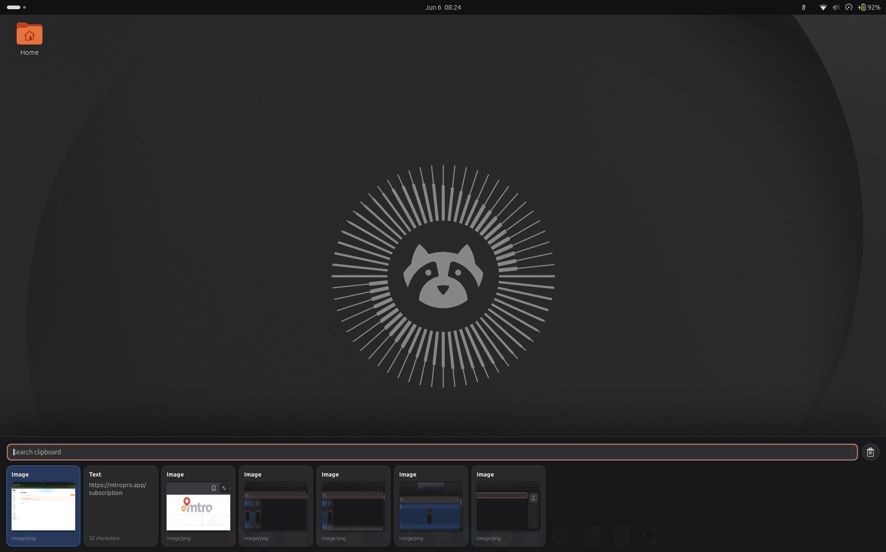

# Pastazzo

```text
 ____   _    ____ _____  _    __________ ___
|  _ \ / \  / ___|_   _|/ \  |__  /__  / _ \
| |_) / _ \ \___ \ | | / _ \   / /  / / | | |
|  __/ ___ \ ___) || |/ ___ \ / /_ / /| |_| |
|_| /_/   \_\____/ |_/_/   \_/____/____\___/
```

Pastazzo is a GNOME Wayland clipboard shelf inspired by Paste. It combines a small Rust history store with a GNOME Shell extension.



Features:

- Open the clipboard shelf with `Shift+Alt+V`
- Search text and image clipboard history
- Click once to copy an item back to the clipboard
- Double-click to copy and paste into the focused app
- Image previews for copied image files and image clipboard content
- Preferences page for changing the open shortcut, available from the shelf settings button
- Clear-history button in the search toolbar

## Install Or Update

On Ubuntu/GNOME:

```bash
curl -fsSL https://raw.githubusercontent.com/turinglabsorg/pastazzo/main/scripts/install.sh | bash
```

The same command updates an existing install: it pulls the latest code, rebuilds the Rust binary, reinstalls the GNOME extension, and keeps your existing history.

After every install or update, log out and log back in. GNOME Shell on Wayland does not reliably reload extension JavaScript inside the current session.

After logging back in, verify or enable the extension:

```bash
gnome-extensions enable pastazzo@turinglabs.org
```

## Verify

```bash
gnome-extensions info pastazzo@turinglabs.org
pastazzo search
```

## Settings

Open the settings page:

```bash
gnome-extensions prefs pastazzo@turinglabs.org
```

You can also open the same page from the settings button beside the clear-history button in the shelf toolbar.

Use the `Open Pastazzo` row to record a new keyboard shortcut. Press `Escape` to cancel recording, `Backspace` or `Delete` to disable the shortcut, or the reset button to restore `Shift+Alt+V`.

The history lives in:

```text
~/.local/share/pastazzo/items
```

## Sync Across Devices

In progress ([#1](https://github.com/turinglabsorg/pastazzo/issues/1)): copy on one device, paste on the others, through a server anyone can host. Everything is end-to-end encrypted: the server, and any relay or proxy in front of it, never sees your clipboard, your password or your keys.

- [docs/SECURITY.md](docs/SECURITY.md): threat model
- [docs/PROTOCOL.md](docs/PROTOCOL.md): cryptography and wire format

Without an account, pastazzo keeps working as it does today, local only.

Run a server (it creates its keys on first start, in `~/.local/share/pastazzo-server`), behind any reverse proxy or tunnel:

```bash
pastazzo-server serve --listen 127.0.0.1:4320
pastazzo-server invite --url https://clip.example.org
```

On the first device, with the invite link:

```bash
pastazzo-sync join 'pastazzo://join?...' --username you
```

It prints the command to log in on the other devices. Then keep `pastazzo-sync run` running: the repository's `systemd` and `launchd` examples are in the issue for now. On GNOME, items from other devices go on the clipboard through the extension, so log out and back in after updating it.

## Development

The repository is a Cargo workspace:

- `crates/pastazzo`: the history store and CLI used by the extension
- `crates/pastazzo-core`: the sync protocol and its end-to-end encryption

Build the backend:

```bash
cargo build --release
```

Run the protocol tests:

```bash
cargo test -p pastazzo-core
```

Install from a local checkout:

```bash
install -Dm755 target/release/pastazzo ~/.local/bin/pastazzo
mkdir -p ~/.local/share/gnome-shell/extensions/pastazzo@turinglabs.org
cp -a extension/. ~/.local/share/gnome-shell/extensions/pastazzo@turinglabs.org/
glib-compile-schemas ~/.local/share/gnome-shell/extensions/pastazzo@turinglabs.org/schemas
gnome-extensions enable pastazzo@turinglabs.org
```

Then log out and log back in before testing changes in GNOME Shell.

Run the UI flow tests:

```bash
cd test-harness
npm install
npm test
```

The test harness mocks the GNOME backend and verifies the shelf layout, image preview, copy/touch ordering, double-click paste, beep event, close behavior, and clear-history button.

## License

[MIT](LICENSE)
